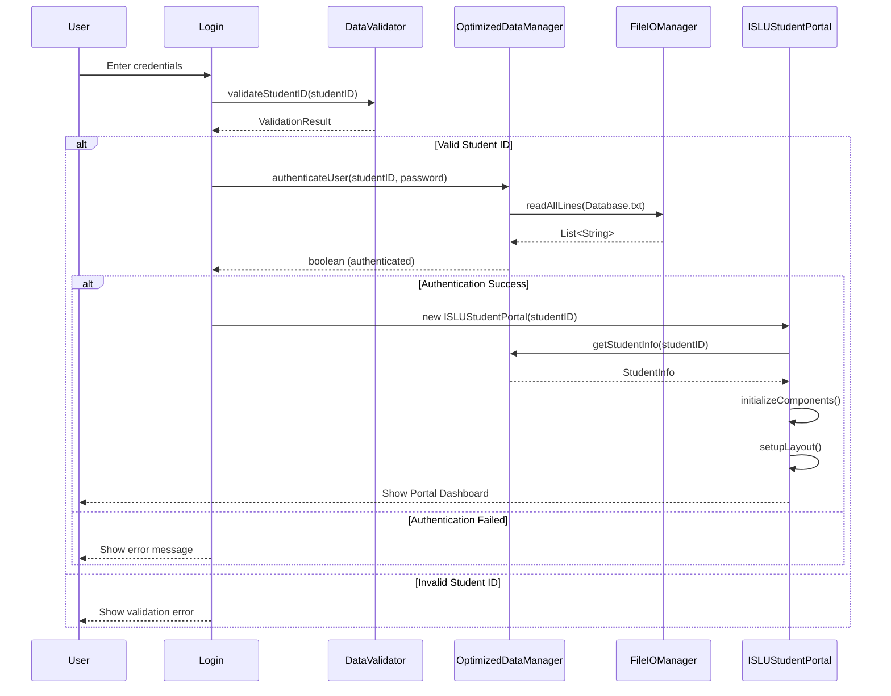
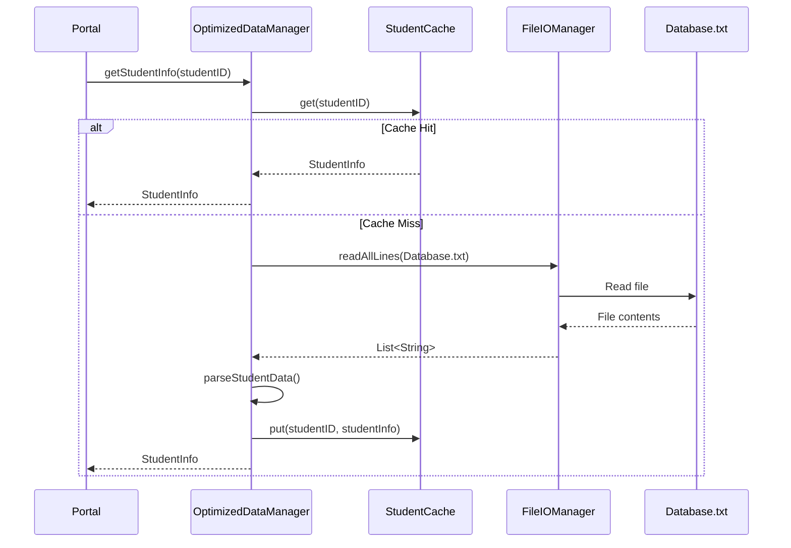
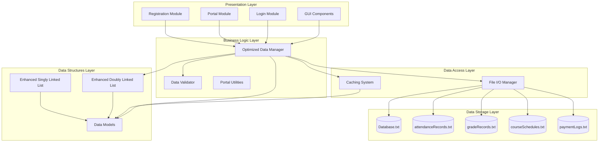
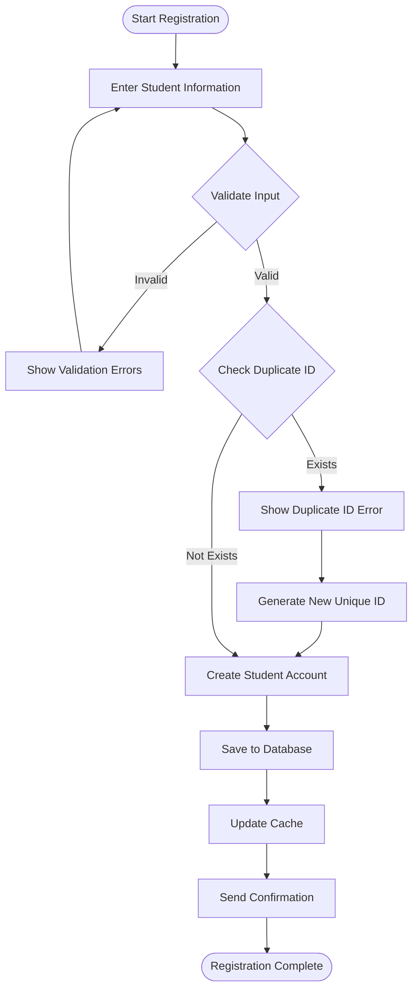
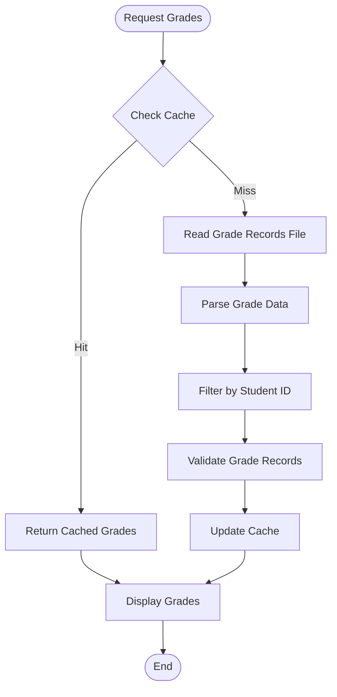
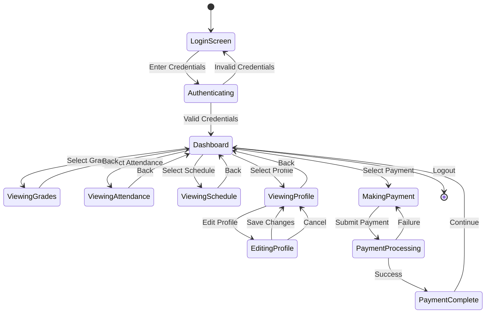
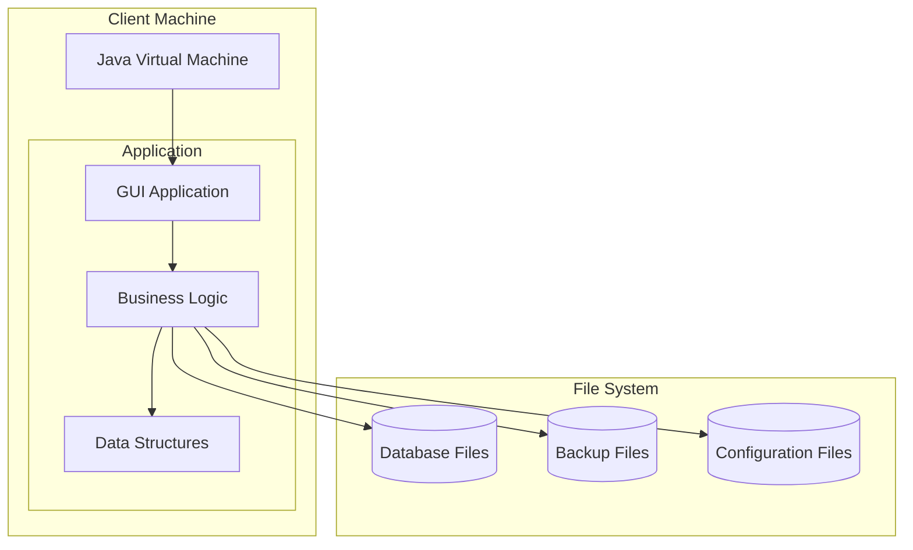
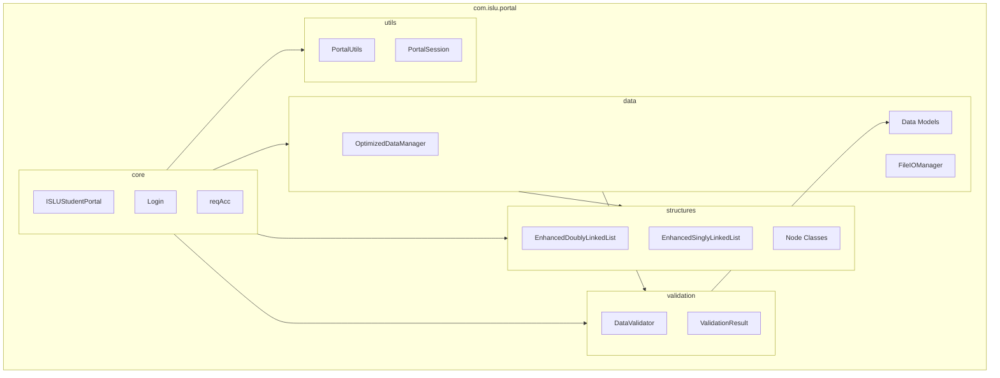

# UML Diagrams for ISLU Student Portal System

## Overview
This document contains comprehensive UML diagrams for the enhanced ISLU Student Portal System, showing the system architecture, class relationships, and behavioral patterns.

## 1. Class Diagram

```mermaid
classDiagram
    %% Core Application Classes
    class ISLUStudentPortal {
        -mainPanel: JPanel
        -contentPanel: JPanel
        -sidebarPanel: JPanel
        -studentID: String
        -studentName: String
        -menu: EnhancedDoublyLinkedList~MenuItem~
        +ISLUStudentPortal(studentID: String)
        +initializeComponents(): void
        +setupLayout(sublist: EnhancedDoublyLinkedList~MenuItem~): void
        +loadAnnouncements(): void
        +startDatabaseMonitoring(): void
    }

    class Login {
        -usernameField: JTextField
        -passwordField: JPasswordField
        +Login()
        +authenticateUser(): boolean
        +showPortal(studentID: String): void
    }

    class reqAcc {
        -registrationForm: JPanel
        -studentInfoFields: Map~String, JTextField~
        +reqAcc()
        +validateInput(): ValidationResult
        +createAccount(): boolean
    }

    %% Enhanced Data Structures
    class EnhancedDoublyLinkedList~T~ {
        -head: DoublyLinkedNode~T~
        -tail: DoublyLinkedNode~T~
        -size: int
        -isSorted: boolean
        -lastUsedComparator: Comparator~T~
        +add(data: T): void
        +get(index: int): T
        +sort(comparator: Comparator~T~): void
        +binarySearch(key: T, comparator: Comparator~T~): int
        +reverse(): void
        +iterator(): Iterator~T~
        +reverseIterator(): Iterator~T~
    }

    class EnhancedSinglyLinkedList~T~ {
        -head: Node~T~
        -tail: Node~T~
        -size: int
        -isSorted: boolean
        +add(data: T): void
        +addFirst(data: T): void
        +addLast(data: T): void
        +get(index: int): T
        +sort(comparator: Comparator~T~): void
        +hasCycle(): boolean
        +reverse(): void
        +getMiddleElement(): T
    }

    class DoublyLinkedNode~T~ {
        -data: T
        -next: DoublyLinkedNode~T~
        -prev: DoublyLinkedNode~T~
        +DoublyLinkedNode(data: T)
        +getData(): T
        +setData(data: T): void
        +getNext(): DoublyLinkedNode~T~
        +getPrev(): DoublyLinkedNode~T~
    }

    class Node~T~ {
        -data: T
        -next: Node~T~
        +Node(data: T)
        +getData(): T
        +setData(data: T): void
        +getNext(): Node~T~
        +setNext(next: Node~T~): void
    }

    %% Data Management Layer
    class OptimizedDataManager {
        -studentCache: Map~String, StudentInfo~
        -attendanceCache: Map~String, List~AttendanceRecord~~
        -gradeCache: Map~String, List~GradeRecord~~
        -paymentCache: Map~String, List~PaymentTransaction~~
        +authenticateUser(studentID: String, password: String): boolean
        +getStudentInfo(studentID: String): StudentInfo
        +getAttendanceRecords(studentID: String): List~AttendanceRecord~
        +getGradeRecords(studentID: String): List~GradeRecord~
        +saveStudentAccount(studentInfo: StudentInfo): boolean
        +generateUniqueStudentID(): String
        +clearCaches(): void
    }

    class FileIOManager {
        -BUFFER_SIZE: int
        -lock: ReadWriteLock
        +readAllLines(file: File): List~String~
        +writeAllLines(file: File, lines: List~String~): void
        +appendLines(file: File, lines: List~String~): void
        +updateLines(file: File, updater: LineUpdater): boolean
        +batchUpdate(fileUpdates: Map~File, List~String~~): void
        +searchInFile(file: File, pattern: String, caseSensitive: boolean): List~SearchResult~
        +getFileStats(file: File): FileStats
        +createBackup(file: File): void
        +restoreFromBackup(file: File): boolean
    }

    class DataValidator {
        -STUDENT_ID_PATTERN: Pattern
        -NAME_PATTERN: Pattern
        -EMAIL_PATTERN: Pattern
        -PHONE_PATTERN: Pattern
        +validateStudentID(studentID: String): ValidationResult
        +validateName(name: String, fieldName: String): ValidationResult
        +validateDate(dateString: String, fieldName: String): ValidationResult
        +validateEmail(email: String): ValidationResult
        +validateGrade(grade: Double, fieldName: String): ValidationResult
        +validateStudentInfo(studentInfo: StudentInfo): ValidationResult
        +batchValidate(items: List~T~, validator: Validator~T~): List~ValidationResult~
    }

    %% Data Models
    class StudentInfo {
        -id: String
        -lastName: String
        -firstName: String
        -middleName: String
        -dateOfBirth: String
        -password: String
        +StudentInfo(id: String, lastName: String, firstName: String, middleName: String, dateOfBirth: String, password: String)
        +getId(): String
        +getFullName(): String
        +toDatabaseFormat(): String
    }

    class AttendanceRecord {
        -studentID: String
        -subjectCode: String
        -subjectName: String
        -date: LocalDate
        -status: String
        -remarks: String
        +AttendanceRecord(studentID: String, subjectCode: String, subjectName: String, date: LocalDate, status: String, remarks: String)
        +toCsvFormat(): String
        +fromCsvFormat(csvLine: String): AttendanceRecord
    }

    class GradeRecord {
        -studentID: String
        -subjectCode: String
        -subjectName: String
        -prelimGrade: Double
        -midtermGrade: Double
        -tentativeFinalGrade: Double
        -finalGrade: Double
        -semester: String
        -status: String
        +GradeRecord(...)
        +calculateOverallGrade(): Double
        +toCsvFormat(): String
        +fromCsvFormat(csvLine: String): GradeRecord
        +toTableRow(): Object[]
    }

    class PaymentTransaction {
        -date: String
        -channel: String
        -reference: String
        -amount: String
        +PaymentTransaction(date: String, channel: String, reference: String, amount: String)
        +getFormattedAmount(): String
    }

    class MenuItem {
        -text: String
        -icon: String
        -action: String
        +MenuItem(text: String, icon: String, action: String)
        +getText(): String
        +getIcon(): String
        +getAction(): String
    }

    %% Validation Classes
    class ValidationResult {
        -valid: boolean
        -errors: List~String~
        -warnings: List~String~
        +ValidationResult(valid: boolean)
        +isValid(): boolean
        +getErrors(): List~String~
        +getWarnings(): List~String~
        +addError(error: String): void
        +addWarning(warning: String): void
    }

    %% File I/O Helper Classes
    class SearchResult {
        -lineNumber: int
        -line: String
        +SearchResult(lineNumber: int, line: String)
        +getLineNumber(): int
        +getLine(): String
    }

    class FileStats {
        -sizeInBytes: long
        -lineCount: int
        -wordCount: int
        +FileStats(sizeInBytes: long, lineCount: int, wordCount: int)
        +getSizeInBytes(): long
        +getLineCount(): int
        +getWordCount(): int
    }

    %% Relationships
    ISLUStudentPortal --> EnhancedDoublyLinkedList : uses
    ISLUStudentPortal --> OptimizedDataManager : uses
    ISLUStudentPortal --> DataValidator : uses
    
    Login --> OptimizedDataManager : authenticates
    Login --> DataValidator : validates
    Login --> ISLUStudentPortal : creates
    
    reqAcc --> OptimizedDataManager : saves
    reqAcc --> DataValidator : validates
    reqAcc --> StudentInfo : creates
    
    OptimizedDataManager --> FileIOManager : uses
    OptimizedDataManager --> StudentInfo : manages
    OptimizedDataManager --> AttendanceRecord : manages
    OptimizedDataManager --> GradeRecord : manages
    OptimizedDataManager --> PaymentTransaction : manages
    
    DataValidator --> ValidationResult : returns
    DataValidator --> StudentInfo : validates
    DataValidator --> AttendanceRecord : validates
    DataValidator --> GradeRecord : validates
    
    FileIOManager --> SearchResult : returns
    FileIOManager --> FileStats : returns
    
    EnhancedDoublyLinkedList --> DoublyLinkedNode : contains
    EnhancedSinglyLinkedList --> Node : contains
    
    EnhancedDoublyLinkedList --> MenuItem : stores
```

## 2. Use Case Diagram

```mermaid
graph TB
    Student((Student))
    Admin((Administrator))
    System((System))
    
    subgraph "Student Portal System"
        UC1[Login to System]
        UC2[View Profile]
        UC3[Update Profile]
        UC4[View Grades]
        UC5[View Attendance]
        UC6[View Schedule]
        UC7[Make Payment]
        UC8[View Payment History]
        UC9[Register Account]
        UC10[Change Password]
        
        UC11[Manage Students]
        UC12[Generate Reports]
        UC13[Backup Data]
        UC14[Restore Data]
        UC15[Monitor System]
    end
    
    Student --> UC1
    Student --> UC2
    Student --> UC3
    Student --> UC4
    Student --> UC5
    Student --> UC6
    Student --> UC7
    Student --> UC8
    Student --> UC9
    Student --> UC10
    
    Admin --> UC11
    Admin --> UC12
    Admin --> UC13
    Admin --> UC14
    Admin --> UC15
    
    UC1 --> System
    UC2 --> System
    UC3 --> System
    UC4 --> System
    UC5 --> System
    UC6 --> System
    UC7 --> System
    UC8 --> System
    UC9 --> System
    UC10 --> System
    UC11 --> System
    UC12 --> System
    UC13 --> System
    UC14 --> System
    UC15 --> System
```

## 3. Sequence Diagram - Student Login Process

## 4. Sequence Diagram - Data Retrieval with Caching

## 5. Component Diagram

## 6. Activity Diagram - Student Registration Process

## 7. Activity Diagram - Grade Retrieval Process

## 8. State Diagram - Student Portal Session

## 9. Deployment Diagram

## 10. Package Diagram

## Summary

These UML diagrams provide a comprehensive view of the enhanced ISLU Student Portal System:

1. **Class Diagram**: Shows all classes and their relationships
2. **Use Case Diagram**: Illustrates system functionality from user perspective
3. **Sequence Diagrams**: Detail interaction flows for key processes
4. **Component Diagram**: Shows system architecture and dependencies
5. **Activity Diagrams**: Model business processes and workflows
6. **State Diagram**: Shows system states and transitions
7. **Deployment Diagram**: Illustrates system deployment structure
8. **Package Diagram**: Shows code organization and dependencies

These diagrams help visualize:
- **System Architecture**: Clear separation of concerns
- **Data Flow**: How information moves through the system
- **Performance Optimizations**: Caching and efficient data structures
- **Error Handling**: Validation and exception management
- **User Interactions**: Complete user journey mapping